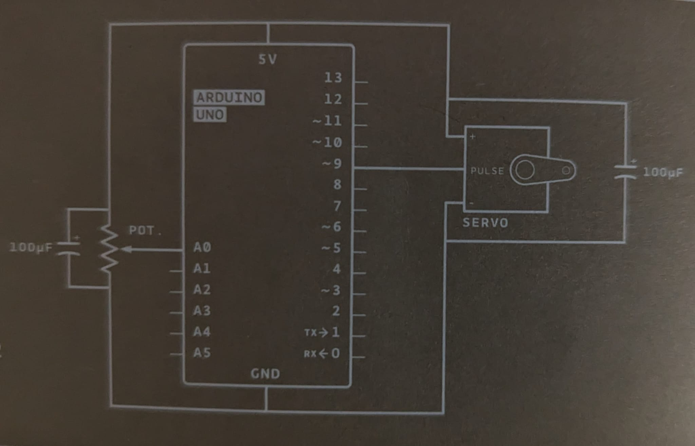
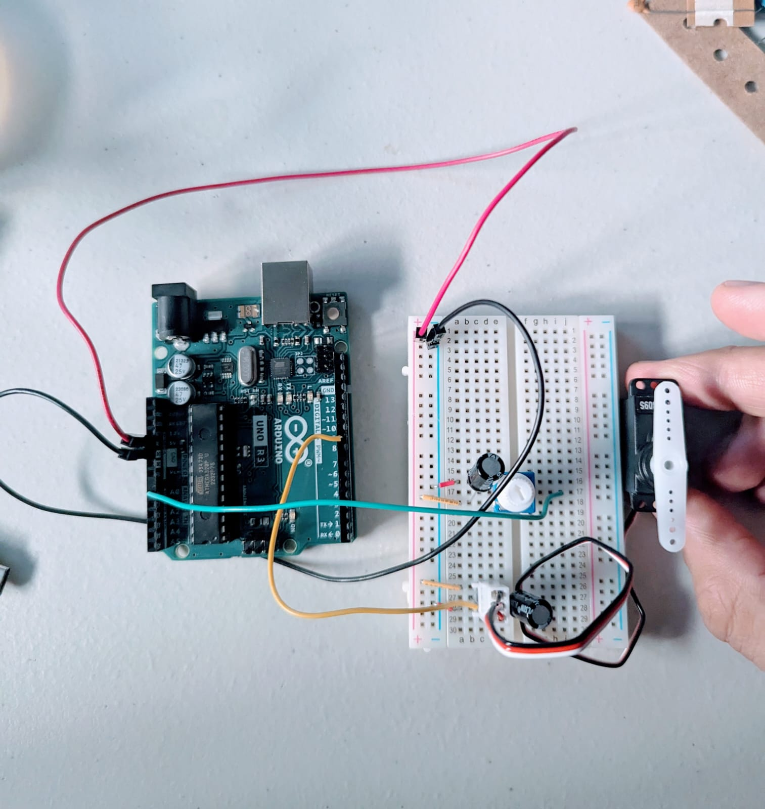

# Arduino Servo Motor Project

This is based on 05. Mood Cue project in the Arduino Starter Kit project book.

The circuit design of the project looks like the following:

We have two central pieces of hardware:
	<ol><li>Servo Motor: which only rotates when it's told to</li>
 	<li>Potentiometer: is capable of producing a variable voltage within the circuit, letting us send the motor different signals</li></ol>

Each of the devices above are accompanied by a capacitor to smooth out the voltage.

For a demo of the project, check out my video here:

